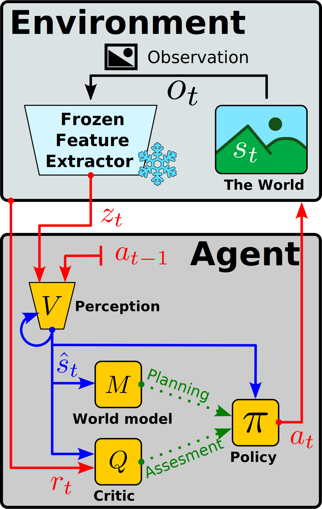

# Frozen Feature Extractors for DeepRL

AGH University of Krakow 
[Center of Excellence in Artificial Intelligence](https://github.com/AGH-CEAI)

## Paper

[Maciej Aleksandrowicz](https://macmacal.github.io) 
, Joanna Jaworek-Korjakowska, 

*Due to a co-author’s preference,* ***the preprint version of this work is not publicly available before formal peer review.*** 
*A public version (with the implementation code) will be made available as soon as possible.*

### Abstract

> This study approaches the deep reinforcement learning issue of sample inefficiency with a paradigm shift for observation encoding.
> The agent’s trained perception module is moved to the environment and kept frozen during training.
> This approach is evaluated on visual observations, utilizing pre-trained visual models.
> While results are not conclusive, they yield preliminary insights for future research directions.

### High level idea

    

**Fig.1** - The overview of the proposed Frozen Feature Extractor architecture for an arbitrary DeepRL agent.